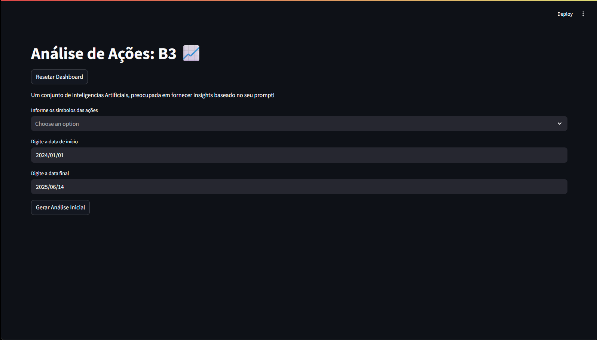
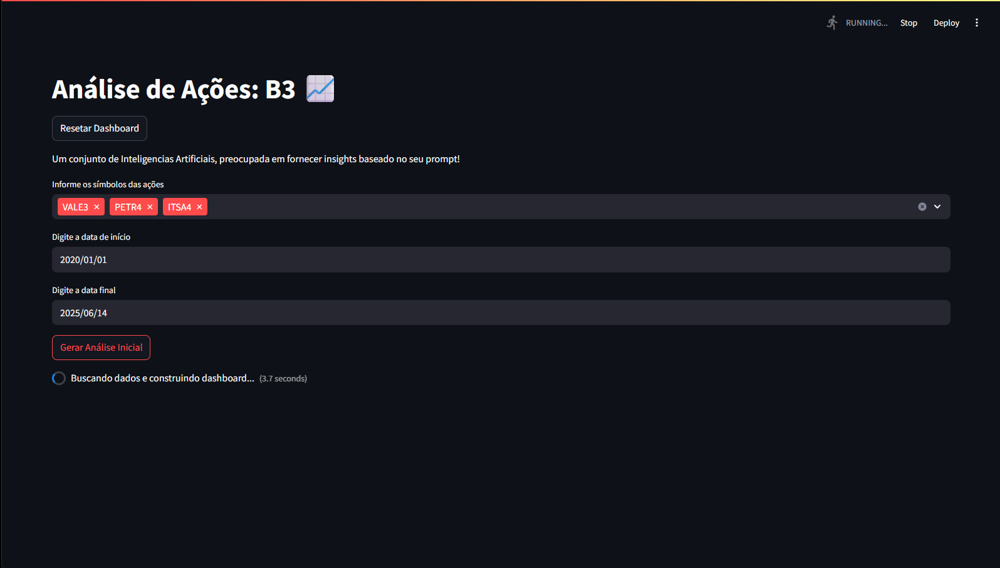
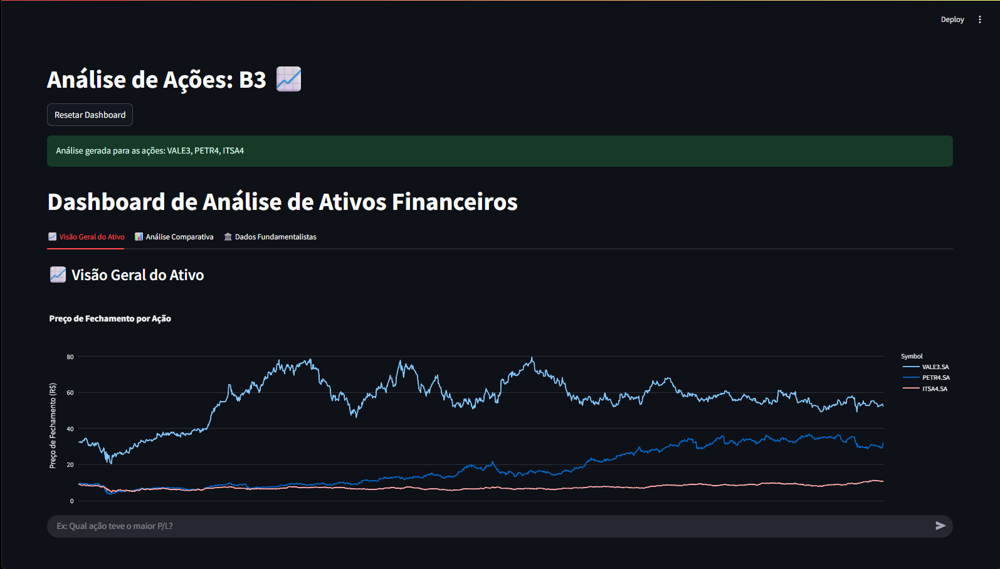
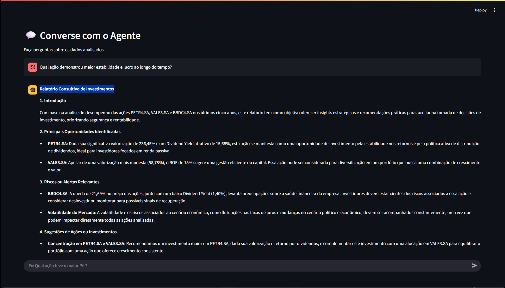

# 📊 Análise Financeira com Agentes Inteligentes - Multiagente Bolsa de Valores
Este projeto utiliza uma arquitetura multiagente baseada em IA para automatizar o processo de análise de ações da bolsa de valores. O sistema é composto por três agentes especializados — Gerente, Analista e Consultor — que trabalham de forma colaborativa para entender a necessidade do usuário, analisar os dados financeiros e gerar recomendações de investimento baseadas em evidências.

## 🧠 Inteligência Multiagente
O sistema foi desenvolvido com base na biblioteca CrewAI, utilizando modelos da **OpenAI (GPT-4o)** e estrutura modular em Python. O processo é dividido em três etapas, executadas por agentes com papéis definidos:

1. **Gerente de Projeto Financeiro**
Interpreta o pedido do usuário e gera um relatório estruturando o problema.

2. **Analista de Dados**
Realiza a análise técnica dos dados contidos no dashboard.

3. **Consultor de Investimentos**
Gera insights e recomendações com base nas análises anteriores.

## 📷 Imagens da Plataforma

### 1. Menu da Interface
</img>

### 2. Upload e Exibição de Dados

</img>

### 3. Geração do Dashboard

</img>

### 4. Geração dos Relatórios

</img>

## 👨‍💻 Sobre o Projeto
Projeto acadêmico realizado por um estudandete do 3º período do curso de Ciência da Computação, na disciplina optativa Ciência de Dados – 2025.1. O objetivo é aplicar na prática conceitos como:

- Sistemas Multiagente com LLMs

- Análise quantitativa de ações

- Automação de fluxos com IA

## 🚀 Como Rodar o Projeto
⚠ O projeto foi desenvolvido em Python 3.11.3 no Windows.

1. Clone o repositório:

```bash 
git clone https://github.com/luccasena/B3-Multiagent-Analyst.git
```

2. Crie o ambiente virtual:

```bash 
py -m venv venv
```

3. Ative o ambiente virtual:

```bash 
venv/Scripts/activate
```
4. Instale as dependências:

```bash 
pip install -r requirements.txt
```

5. Execute a interface web:

```bash 
streamlit run streamlit_app.py
```

## ⚠ Observações
- Este projeto é experimental e voltado para fins educacionais.

- As recomendações geradas pelos agentes não substituem a consulta a um profissional certificado.

- A interface e parte dos textos foram aprimorados com o auxílio de ferramentas de IA generativa.